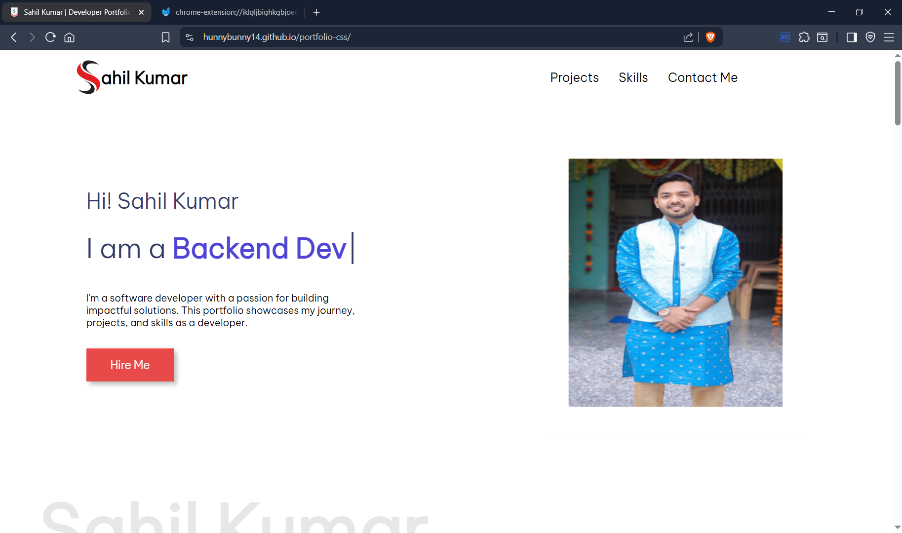

# 🚀 Sahil Kumar – Portfolio Website

Welcome to my **personal portfolio website** built using **HTML, CSS, and JavaScript**.  
This site showcases my journey as a software developer, my skills, and my projects.

---

## 🔗 Live Demo  
🌐 [View Live Website](https://hunnybunny14.github.io/sahil-portfolio/)

---

## 🛠️ Tech Stack
- **HTML5** – Structure of the website  
- **CSS3** – Styling and layout  
- **JavaScript** – Interactive behavior

---

## 📁 Folder Structure
📂 sahil-portfolio/
├── index.html # Main HTML page
├── style.css # Stylesheet
└── Images/
└── userAsset/
└── preview.png 

---

## 🖼️ Website Preview  

---

## 📬 Connect with Me
- 📧 [Email](mailto:sahilkumar954815@gmail.com)
- 💼 [LinkedIn](https://www.linkedin.com/in/sahilkumar2114/)
- 🐱 [GitHub](https://github.com/hunnyBunny14)
- 📷 [Instagram](https://www.instagram.com/hunny.aibot/)
- 🐦 [Twitter (X)](https://x.com/HunnyEngineer)

---

## 🧠 Features
- Responsive design for all devices  
- Smooth scroll and animations  
- Clean UI to highlight profile and projects  

---

## 📌 Future Plans
- Add project cards dynamically via JavaScript  
- Integrate contact form with backend  
- Deploy advanced version with React or Next.js

---

## 🙌 Thank You for Visiting!

If you like it, don’t forget to ⭐ the repo!

